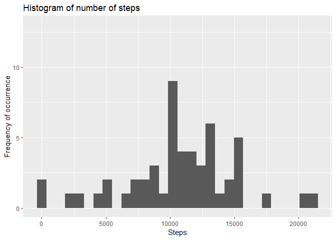
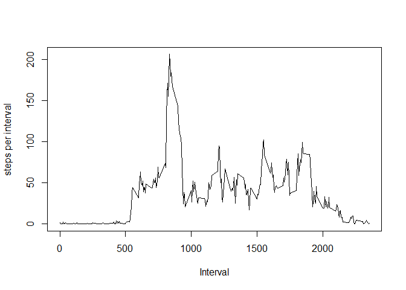
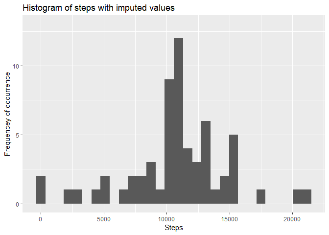
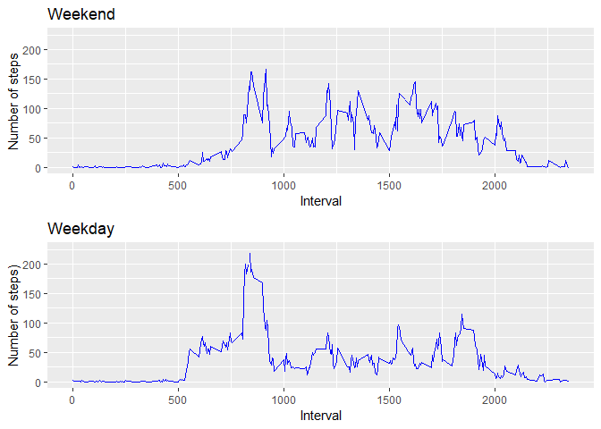

## Loading and preprocessing the data

```r
  #Call the required libraries
  library(ggplot2)
```

```
## Warning: package 'ggplot2' was built under R version 3.4.4
```

```r
  library(gridExtra)
```

```
## Warning: package 'gridExtra' was built under R version 3.4.4
```

```r
  library(rmarkdown) 
```

```
## Warning: package 'rmarkdown' was built under R version 3.4.4
```

```r
#Read in data from read.csv file
  ActivityData <- read.csv(file="activity.csv", header=TRUE)
  ActivityDatanoNA <- na.omit(ActivityData)
```

## What is the average daily activity pattern?


```r
## What is mean total number of steps taken per day?
  
  #Aggregate the numbers of steps per day and find the sum
  daysteps <- aggregate(. ~date,data=ActivityDatanoNA,sum)
  #subset on date and steps
  daysteps <- subset(daysteps, select = c(date, steps))
  #Format the date field as date 
  daysteps$date <- as.Date(daysteps$date,format="%Y-%m-%d")
  
  print("The Mean number of steps per day is:")
```

```
## [1] "The Mean number of steps per day is:"
```

```r
  print(mean(daysteps$steps))
```

```
## [1] 10766.19
```

```r
  print("Median number of steps per day")
```

```
## [1] "Median number of steps per day"
```

```r
  print(median(daysteps$steps))
```

```
## [1] 10765
```

```r
  #Create a histogram of the number of steps per day. This will show the frequency of the number of days at each step per day value
  #The bin value is the default of 30 but could be adjusted.
  
  print(qplot(daysteps$steps, geom="histogram",main="Histogram of number of steps",xlab="Steps", ylab="Frequency of occurrence",ylim=c(0,13)))
```

```
## `stat_bin()` using `bins = 30`. Pick better value with `binwidth`.
```

<!-- -->

```r
  #Find the mean number of steps per interval
  meanintervals <- aggregate(. ~interval,data=ActivityDatanoNA,mean)
  
  maxinterval <- which.max(meanintervals$steps)
  maxrecord <- meanintervals[maxinterval,]
  print("The interval with the maximum number of steps is:")
```

```
## [1] "The interval with the maximum number of steps is:"
```

```r
  print(maxrecord[,"interval"])
```

```
## [1] 835
```

```r
  #Create a line plot of the number of steps per interval
  
  plot(meanintervals$interval,meanintervals$steps,type="l",xlab="Interval",ylab="steps per interval")
```

<!-- -->

## Imputing missing values

```r
  #Report on the number of NAs
  NumberofNAS <- sum(is.na(ActivityData))
  print("Number of NAs")
```

```
## [1] "Number of NAs"
```

```r
  print(NumberofNAS)
```

```
## [1] 2304
```

```r
  #Remove the NAs
  ActivityDatanoNA <- na.omit(ActivityData)
  
  #Aggregate the data based on date and find the sum for each date
  daysteps <- aggregate(. ~date,data=ActivityDatanoNA,sum)
  daysteps <- subset(daysteps, select = c(date, steps))
  daysteps$date <- as.Date(daysteps$date,format="%Y-%m-%d")
  
  #Find the mean values for each interval in the data that excludes NAs
  meanintervals <- aggregate(. ~interval,data=ActivityDatanoNA,mean)
  
  #insert a value for a missing interval based on the mean value for that interval
  for (i in 1:nrow(ActivityData)) {
    #for every row with an NA, determine its interval number
    if (identical(as.character(ActivityData[i,"steps"]),as.character(NA))==TRUE) {
      intervalnum<-ActivityData[i,"interval"]
      #find the mean steps value for that interval
      whichmeaninterval <- which(meanintervals$interval==intervalnum)
      #print(whichmeaninterval)
      ActivityData[i,"steps"] <- meanintervals[whichmeaninterval,"steps"]
    }
    
  }
  
  
  # meanintervalsnoNAdata <- aggregate(. ~interval,data=ActivityData,mean)
  
  
  #aggregate on date the sum of the number of steps
  daystepsimputed <- aggregate(. ~date,data=ActivityData,sum)
  
  #Create a subset using only date and number of steps
  daystepsimputed <- subset(daystepsimputed, select = c(date, steps))
  daystepsimputed$date <- as.Date(daystepsimputed$date,format="%Y-%m-%d")
  
  
  #Mean and median number of steps taken each day
  print("Mean number of steps per day with imputed data added:")
```

```
## [1] "Mean number of steps per day with imputed data added:"
```

```r
  print(mean(daystepsimputed$steps))
```

```
## [1] 10766.19
```

```r
  print("Median number of steps per day with imputed data added:")
```

```
## [1] "Median number of steps per day with imputed data added:"
```

```r
  print(median(daystepsimputed$steps))
```

```
## [1] 10766.19
```

```r
  #Create the plot
  
  print(qplot(daystepsimputed$steps, geom="histogram",main="Histogram of steps with imputed values",xlab="Steps", ylab="Frequencey of occurrence",ylim=c(0,13)))
```

```
## `stat_bin()` using `bins = 30`. Pick better value with `binwidth`.
```

<!-- -->


## Are there differences in activity patterns between weekdays and weekends?

```r
 ##Differences in activity patterns between weekdays and weekends
  
  
  
  #Read in data from read.csv file
  ActivityData <- read.csv(file="activity.csv", header=TRUE)
  
  #Omit NAs from the data
  #ActivityDatanoNA <- na.omit(ActivityData)
  
  #Aggregate the number of steps based on the interval and take the mean for each interval with a value
  #These values will be substituted in for missing values in the appropriate interval.
  meanintervals <- aggregate(. ~interval,data=ActivityDatanoNA,mean)
  
  #Define what weekend days are (it's easier than listing all the weekdays)
  weekenddays <- c("Saturday","Sunday")
  
  for (i in 1:nrow(ActivityData)) {
    #for every row with an NA, determine its interval number
    if (identical(as.character(ActivityData[i,"steps"]),as.character(NA))==TRUE) {
      intervalnum<-ActivityData[i,"interval"]
      #find the mean steps value for that interval
      whichmeaninterval <- which(meanintervals$interval==intervalnum)
      #Substituted the mean value for each interval that has an NA in the original dataset
      ActivityData[i,"steps"] <- meanintervals[whichmeaninterval,"steps"]
    }
    if ((as.character(weekdays(as.Date(ActivityData[i,"date"], format="%Y-%m-%d"))) %in% as.character(weekenddays))!=TRUE) {
      
      ActivityData[i,"weekday"] <- "weekday" 
    }
    else
    {
      ActivityData[i,"weekday"] <- "weekend"
    }
    
  }
  #Set the format for the date
  ActivityData$date <- as.Date(ActivityData$date,format="%Y-%m-%d")
  
  #Create a subset for weekend data
  weekenddata <- subset(ActivityData,weekday=="weekend",select=c(interval,steps))
  
  #Create a subset for Weekday data
  weekdaydata <- subset(ActivityData,weekday=="weekday",select=c(interval,steps))
  
  #Aggregate the numbers of steps for intervals on weekends
  intervalstepsweekend <- aggregate(. ~interval,data=weekenddata,mean)
  
  #Aggregate the numbers of steps for intervals on weekdays
  intervalstepsweekday <- aggregate(. ~interval,data=weekdaydata,mean)
  
  
  require(gridExtra)
  plot1 <- qplot(interval,steps,data= intervalstepsweekend,geom="line",main="Weekend",xlab="Interval",ylab="Number of steps",ylim=c(0,225),colour=I("blue"))  
  plot2 <- qplot(interval,steps,data = intervalstepsweekday,geom="line",main="Weekday",xlab="Interval", ylab="Number of steps)",ylim=c(0,225),colour=I("blue"))
  grid.arrange(plot1, plot2, ncol=1)
```

<!-- -->


